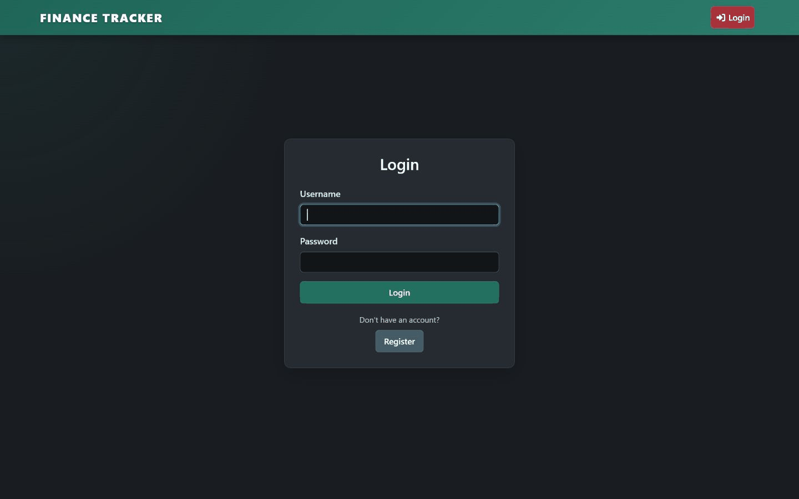

<div align="center">


### Finances Tracker

_A small Flask application for tracking monthly finances. Built with SQLite and uv, and designed for local or containerised runs._

_Current release: [v1.2.5](https://github.com/sudo-kraken/finances-tracker/releases/tag/v1.2.5)_

</div>

<div align="center">

[](https://github.com/sudo-kraken/finances-tracker/pkgs/container/finances-tracker) [](https://github.com/sudo-kraken/helm-charts/tree/main/charts/finances-tracker) [](https://github.com/sudo-kraken/finances-tracker/blob/main/pyproject.toml)
</div>

<div align="center">

[](https://scorecard.dev/viewer/?uri=github.com/sudo-kraken/finances-tracker)

</div>

## Demo
<div align="center">
  
  
*Animation shows sign-in, monthly workspaces, two accounts side by side, and adding a bill.*
</div>

## Contents

- [Overview](#overview)
- [Architecture at a glance](#architecture-at-a-glance)
- [Features](#features)
- [Prerequisites](#prerequisites)
- [Quick start](#quick-start)
- [Docker](#docker)
- [Configuration](#configuration)
- [Authentication and OpenID Connect](#authentication-and-openid-connect)
- [Database upgrades](#database-upgrades)
- [Health](#health)
- [Production notes](#production-notes)
- [Development](#development)
- [Troubleshooting](#troubleshooting)
- [Licence](#licence)
- [Security](#security)
- [Contributing](#contributing)
- [Support](#support)

## Overview

Create an account, sign in, and manage accounts, bills and incomes within monthly workspaces. The app uses Decimal handling for money values and provides a `/health` endpoint for orchestration.

## Architecture at a glance

- Flask app factory with `app:app` WSGI target
- SQLAlchemy for persistence
- Flask-Login for session management
- Health endpoint `GET /health`

## Features

- Per-user financial workspaces protected by Flask-Login
- Optional OpenID Connect sign-in, including an OIDC-only mode
- Monthly workspaces with accounts, bills and incomes
- Accurate Decimal handling for money values
- Persistent SQLite storage with automatic schema upgrades
- `/health` endpoint for liveness checks
- Reproducible local development with uv
- Prebuilt container image on GHCR

## Prerequisites

- [Docker](https://www.docker.com/) / [Kubernetes](https://kubernetes.io/)
- (Alternatively) [uv](https://docs.astral.sh/uv/) and Python 3.10 or newer for local development

## Quick start

Local development with uv

```bash
export SECRET_KEY="$(python -c 'import secrets; print(secrets.token_hex(32))')"
uv sync --all-extras
uv run flask --app app:app run --host 0.0.0.0 --port ${PORT:-7070}
```

## Docker

Pull and run

```bash
docker pull ghcr.io/sudo-kraken/finances-tracker:latest
docker run --rm -p 7070:7070 \
  -e PORT=7070 \
  -e SECRET_KEY="replace-with-a-long-random-value" \
  -v finances-data:/app/app/db \
  ghcr.io/sudo-kraken/finances-tracker:latest
```

The supplied rootless Podman Quadlet requires a private environment file instead
of embedding a secret in the unit. Create it before starting the unit:

```bash
install -d -m 0700 "$HOME/.config/containers/systemd"
printf 'SECRET_KEY=%s\n' "$(openssl rand -hex 32)" \
  > "$HOME/.config/containers/systemd/financestracker.env"
chmod 0600 "$HOME/.config/containers/systemd/financestracker.env"
```

Keep this file stable across restarts; changing the key invalidates existing
login sessions. A missing or empty key prevents the application from starting.

## Kubernetes (Helm)

You can deploy the app on Kubernetes using the published Helm chart:

```bash
helm install finances-tracker oci://ghcr.io/sudo-kraken/helm-charts/finances-tracker \
  --namespace finances-tracker --create-namespace
```

By default, the chart generates its own development `SECRET_KEY` and creates a PersistentVolumeClaim for the SQLite database.  
For production use, override values such as `secret.create=false` and provide your own secret.

## Configuration

| Variable | Required | Default | Description |
|----------|----------|---------|-------------|
| PORT | no | 7070 | Port to bind |
| WEB_CONCURRENCY | no | 2 | Gunicorn worker processes |
| SECRET_KEY | yes |  | Long random key used to protect sessions and CSRF tokens |
| DATABASE_FOLDER | no | app/db | Folder for the bundled SQLite database |
| SQLALCHEMY_DATABASE_URI | no | sqlite:///\<DATABASE_FOLDER\>/finances.db | Advanced database URI override; the packaged app includes only the SQLite driver |
| FINANCES_TESTING | no | 0 | Enables test configuration |
| ALLOW_REGISTRATION | no | false | Allow additional users after the first account is created |
| SESSION_COOKIE_SECURE | no | false | Only send session cookies over HTTPS |
| OIDC_ISSUER_URL | no |  | OpenID Connect issuer base URL, such as `https://id.example.com`; required with the other core OIDC variables when OIDC is enabled |
| OIDC_CLIENT_ID | no |  | Client ID issued by the OpenID Provider |
| OIDC_CLIENT_SECRET | no |  | Client secret for the confidential OIDC client; keep this out of source control |
| OIDC_REDIRECT_URI | no |  | Exact public callback URL, ending in `/auth/oidc/callback`; required when OIDC is enabled |
| OIDC_DISPLAY_NAME | no | Pocket ID | Provider name shown on sign-in and account-linking controls |
| OIDC_AUTO_PROVISION | no | false | Create a new local account for an otherwise unknown OIDC identity; existing accounts are never matched by email or username |
| OIDC_ONLY | no | false | Disable local username/password sign-in and registration; requires a complete OIDC configuration |

`.env` example

```dotenv
PORT=7070
WEB_CONCURRENCY=2
SECRET_KEY=replace-with-a-long-random-value
DATABASE_FOLDER=/app/app/db
SQLALCHEMY_DATABASE_URI=sqlite:////app/app/db/finances.db
ALLOW_REGISTRATION=false
SESSION_COOKIE_SECURE=true

# Optional OpenID Connect / Pocket ID configuration; uncomment all four core settings together
# OIDC_ISSUER_URL=https://id.example.com
# OIDC_CLIENT_ID=replace-with-client-id
# OIDC_CLIENT_SECRET=replace-with-client-secret
# OIDC_REDIRECT_URI=https://finances.example.com/auth/oidc/callback
# OIDC_DISPLAY_NAME=Pocket ID
# OIDC_AUTO_PROVISION=false
# OIDC_ONLY=false
```

On an empty installation, the registration page remains available until the
first account is created. Further registration is disabled unless
`ALLOW_REGISTRATION=true`. Local registration is always disabled when
`OIDC_ONLY=true`.

## Authentication and OpenID Connect

OpenID Connect is optional and runs alongside the existing local password
login by default. Leave `OIDC_ISSUER_URL`, `OIDC_CLIENT_ID`, `OIDC_CLIENT_SECRET` and
`OIDC_REDIRECT_URI` all unset to preserve the local-only behaviour. When OIDC
is enabled, all four are required; a partial configuration fails startup rather
than exposing a broken sign-in option. Existing usernames, password hashes,
ownership and financial data are not changed when OIDC is enabled.

The app identifies an external account by the provider's immutable issuer and
subject values. It never links an existing account by email, display name or
username. An existing user should sign in with their local password and use the
account-linking action before signing in through Pocket ID. Once linked, either
sign-in method opens the same local account and data. A recently password-authenticated
user can also disconnect Pocket ID from the Account page if the wrong identity
was linked or the connection needs to be replaced.

To require Pocket ID for authentication, first connect every required existing
local account and verify that OIDC login reaches the correct financial data. Then set
`OIDC_ONLY=true` and restart the application. This removes the local login and
registration forms, rejects direct username/password login and registration
requests, ends existing non-OIDC sessions on their next request, and prevents
the connected identity from being disconnected. `OIDC_ONLY` takes precedence
over `ALLOW_REGISTRATION` and startup fails if the OIDC client configuration is
missing. Set `OIDC_ONLY=false` again to restore local login; existing password
hashes and account data are not changed.

Unknown OIDC identities are rejected by default. Set
`OIDC_AUTO_PROVISION=true` only if users who have not linked or registered a
local account should be allowed to create one automatically. Auto-provisioning
does not merge identities into existing accounts. These automatically created
accounts are OIDC-only and do not receive a usable local password.

Signing out clears the Finances Tracker session but does not end the user's
Pocket ID single sign-on session. Disabling a user in Pocket ID prevents future
OIDC sign-ins but does not revoke an already active Finances Tracker browser
session. In the default mixed-authentication mode, existing users who have a
local password can still use it if the identity provider is unavailable;
OIDC-only auto-provisioned users cannot. When `OIDC_ONLY=true`, there is no
local fallback during an identity-provider outage.

### Pocket ID setup

1. Create an OIDC client in Pocket ID and leave **Public Client** disabled. The
   application is a confidential server-side client.
2. Enable PKCE for the client. The application uses the `S256` challenge
   method.
3. Register the exact public callback URL. It must end in
   `/auth/oidc/callback`, for example
   `https://finances.example.com/auth/oidc/callback`.
4. Configure the application to request the `openid profile email` scopes.
5. Under **Allowed User Groups**, select the Pocket ID groups that may use the
   client, or explicitly unrestrict it. A new Pocket ID client does not permit
   users until this is configured.
6. Copy the issuer URL, client ID and generated client secret into the private
   application environment. Use the Pocket ID base issuer URL, without adding
   `/.well-known/openid-configuration`; discovery is handled automatically.

Set `OIDC_REDIRECT_URI` explicitly when the app is behind Traefik or another
reverse proxy so the authorization request uses the same external HTTPS URL
registered in Pocket ID. Set `SESSION_COOKIE_SECURE=true` whenever that public
URL is HTTPS. Keep `SECRET_KEY` and `OIDC_CLIENT_SECRET` stable and load them
from an environment file, container secret or equivalent secret store rather
than committing them.

## Database upgrades

Schema upgrades run automatically during application startup. Existing
databases are upgraded in place and their rows are preserved; no manual
migration command is required. Back up the database volume before deploying a
new application version as part of normal operational practice.

Enabling OIDC adds its identity mappings through the same automatic migration
process. Existing local users require no database preparation, and their
password hashes remain unchanged. Password sign-in remains available unless
`OIDC_ONLY=true`.

When ownership is added to an older database, existing financial data is
assigned to its first user. If the database contains financial data but no user,
the data is held by an unloginable migration account and transferred to the
first subsequently registered user.

## Health

- `GET /health` returns `{ "status": "healthy" }` when the database connection succeeds.
- A database failure returns HTTP 503 with `{ "status": "unhealthy" }`; internal error details are logged rather than exposed.

## Data and backups

- For SQLite, mount a volume to persist `app/db/finances.db` when using Docker.
- The packaged application and container support SQLite. A custom external
  database URI requires installing its Python driver in a custom build.

## Production notes

- Always set `SECRET_KEY` to a long random value and keep it stable between restarts.
- If you expose the app on the internet, put it behind a reverse proxy that terminates TLS and sets secure cookies.
- Set `SESSION_COOKIE_SECURE=true` whenever the app is served exclusively over HTTPS.

## Development

```bash
uv run ruff check --fix .
uv run ruff format .
uv run pytest --cov
```

## Troubleshooting

- If the app fails to start with a database error, verify `SQLALCHEMY_DATABASE_URI` and that the target directory exists for SQLite.
- If Pocket ID reports an invalid callback, verify that `OIDC_REDIRECT_URI` exactly matches its registered callback, including the scheme, host and `/auth/oidc/callback` path.
- If Pocket ID denies access, assign the user to one of the client's allowed groups or explicitly unrestrict the client.
- If log output is noisy, adjust the logging level via your process manager or container runtime.

## Licence
See [LICENSE](LICENSE)

## Security
See [SECURITY.md](SECURITY.md)

## Contributing
Feel free to open issues or submit pull requests if you have suggestions or improvements.
See [CONTRIBUTING.md](CONTRIBUTING.md)

## Support
Open an [issue](/../../issues)
